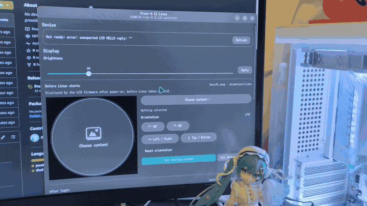

# Frozr-O II Linux

Unofficial Linux controller for the XIGMATEK Frozr-O II LCD.



## Install

Download and install the latest `.deb`:

```bash
wget https://github.com/Xeift/frozro2-linux/releases/latest/download/frozro2-linux_latest_all.deb
sudo apt install ./frozro2-linux_latest_all.deb
```

Then launch **Frozr-O II Linux** from the app menu.

If the LCD is unavailable after the first install, reconnect its internal USB connection or reboot once.

## Configuration

- **Before Linux starts** — set the firmware startup image, animation, or video.
- **After login** — show normal content or run the system dashboard. The last state is restored automatically on login.
- **Brightness** — shared by both phases.
- **Library** — view, play, and delete uploaded media.


## Features

- static images, GIF, APNG, animated WebP, and video
- rotation and horizontal/vertical mirroring
- firmware-native startup content
- CPU, GPU, RAM, temperature, time/date dashboard
- on-device media management
- automatic login restore
- GTK4 / Libadwaita GUI
- `frozrctl` CLI

## Tested hardware

Tested on **XIGMATEK Frozr-O II Arctic 240**.

## Build from source

```bash
git clone https://github.com/Xeift/frozro2-linux.git
cd frozro2-linux
sudo apt install gjs ffmpeg gir1.2-gtk-4.0 gir1.2-adw-1
./install.sh --udev
```

Build a Debian package:

```bash
sudo apt install dpkg-dev
./packaging/build-deb.sh
```

## CLI

```bash
frozrctl status
frozrctl doctor
frozrctl brightness 35
frozrctl image ~/Pictures/image.png
frozrctl media ~/Pictures/animation.gif --background
frozrctl dashboard
frozrctl stop
```

Run `frozrctl --help` for all commands.


## License

MIT. See `LICENSE`.

Frozr-O II Linux is not affiliated with XIGMATEK. This is an independent open-source project.
